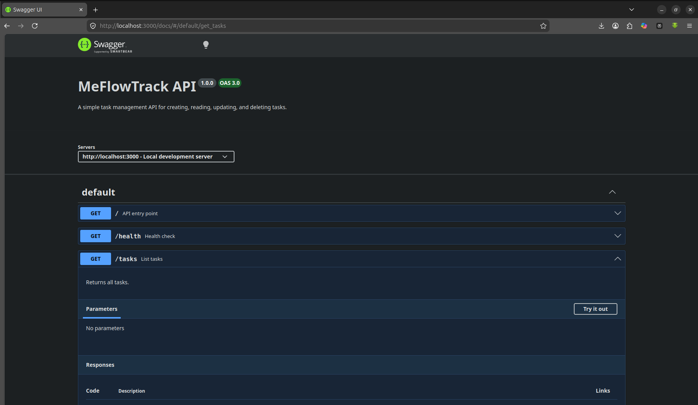

# MeFlowTrack

A simple Express-based task management API with Swagger documentation.

## Features

- Get API metadata and available endpoints: `GET /`
- Health check: `GET /health`
- List tasks: `GET /tasks`
- Get a task by ID: `GET /tasks/{id}`
- Create a task: `POST /tasks`
- Update a task: `PUT /tasks/{id}`
- Delete a task: `DELETE /tasks/{id}`
- Swagger UI documentation: `GET /docs`

## Requirements

- Node.js 18+ (or compatible)
- npm

## Setup

1. Install dependencies:

```bash
npm install
```

2. Start the server:

```bash
npm run dev
```

3. Open the API docs in your browser:

```text
http://localhost:3000/docs
```

## Swagger UI Preview



## API Examples

### Get all tasks

```bash
curl http://localhost:3000/tasks
```

### Get a task by ID

```bash
curl http://localhost:3000/tasks/1
```

### Create a new task

```bash
curl -X POST http://localhost:3000/tasks \
  -H "Content-Type: application/json" \
  -d '{"title": "Buy groceries"}'
```

### Update a task

```bash
curl -X PUT http://localhost:3000/tasks/1 \
  -H "Content-Type: application/json" \
  -d '{"title": "Buy groceries and cook", "done": true}'
```

### Delete a task

```bash
curl -X DELETE http://localhost:3000/tasks/1
```

## Notes

- The API uses an in-memory task list, so all changes are lost when the server restarts. This is becuase the list is initialised when the server runs and is only available for that sesssion, after restart, it is cleared
- The Swagger documentation is loaded from `swagger.json`.
